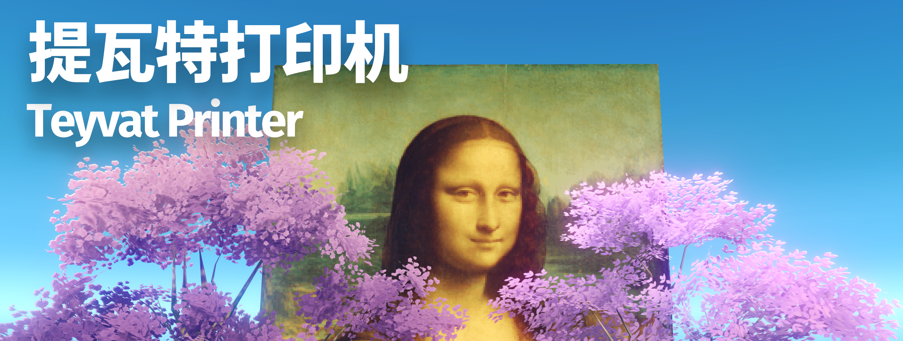
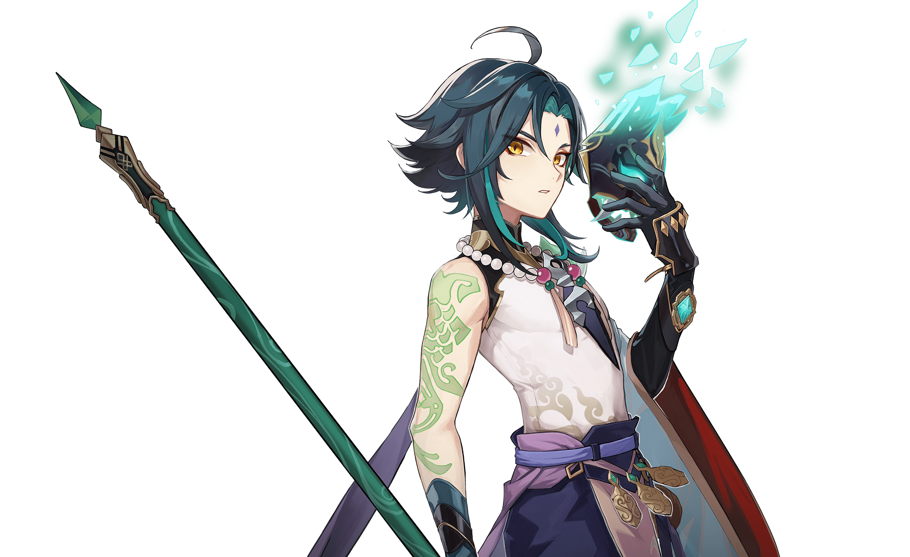
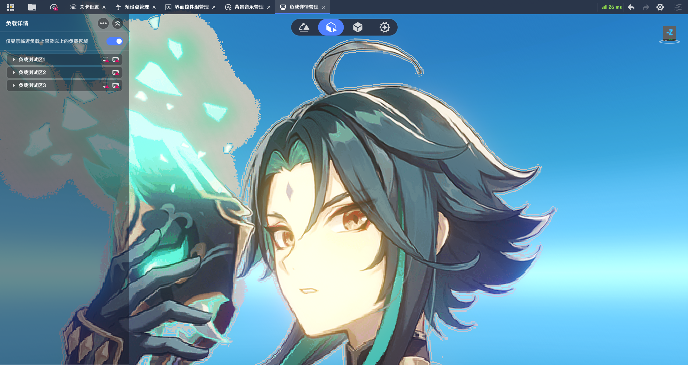

# 提瓦特打印机 Teyvat-Printer



## 命令与参数速查

主命令格式：

```powershell
python gil_tool.py map-image --input ".\gil_map\模板.gil" --image ".\input.png" [参数]
```

> `map-image` 默认只执行 dry-run。只有添加 `--write` 才会写入文件；写入时必须指定
> `--output`，对象或父物体数量发生变化时还必须添加 `--allow-count-change`。

### 输入、输出与目标

| 参数 | 是否必需 / 默认值 | 说明 |
| --- | --- | --- |
| `--input FILE` | 必需 | 输入的 `.gil` 原始模板。不要把已经生成的多父物体文件再次作为模板。 |
| `--image FILE` | 必需 | 要转换的图片，支持 Pillow 可读取的 PNG、WebP、JPEG 等格式。 |
| `--output FILE` | 写入时必需 | 新 `.gil` 文件的保存路径；不能与输入路径相同。 |
| `--parent-id ID` | 自动识别 | 指定要替换的场景空模型父节点；模板中只有一个候选时可省略。 |
| `--asset-id ID` | 模板常用资产 | 指定装饰物模型资产 ID。当前平面示例使用 `10009003`。 |

### 图片采样与合并

| 参数 | 默认值 | 说明 |
| --- | --- | --- |
| `--width N` | 自动计算 | 目标像素宽度。只给宽或高时保持原图比例；宽高都省略时按 `--max-decorations` 自动计算。 |
| `--height N` | 自动计算 | 目标像素高度；与 `--width` 同时指定时严格使用给定尺寸。 |
| `--filter NAME` | `nearest` | 缩放算法：`nearest`、`box`、`bilinear`、`bicubic` 或 `lanczos`。 |
| `--colors N` | 不量化 | 无抖动量化到 `2`～`256` 色，再生成装饰物。 |
| `--merge-same-color` | 关闭 | 把相邻同色像素合并为更大的矩形，减少装饰物数量。 |
| `--alpha-threshold N` | `0` | 跳过 Alpha 小于或等于该值的像素；适用于带透明通道的图片。 |
| `--max-decorations N` | `10000` | 整幅图允许的装饰物总上限；省略宽高时也作为自动尺寸的像素预算。 |

### 布局、尺寸与位置

| 参数 | 默认值 | 说明 |
| --- | --- | --- |
| `--layout MODE` | `batched` | 布局模式：`batched` 按数量分组；`tiled` 按空间分块；`single-parent` 强制使用单父物体，仅供低数量实验。 |
| `--single-parent` | 关闭 | `--layout single-parent` 的快捷写法，与 `--layout` 互斥。 |
| `--max-per-parent N` | `999` | `batched` 模式下每个父物体最多承载的装饰物数量。 |
| `--tile-size N` | `10` | `tiled` 模式下每个父物体覆盖的空间像素边长，即默认 `10×10`。 |
| `--pixel-size N` | `0.1` | 单个像素装饰物的局部尺寸。 |
| `--z N` | 平面为 `0` | 显式指定装饰物的局部 Z 中心；其他模型默认使用 `0.5 - pixel-size / 2`。 |
| `--decoration-rotation X Y Z` | 自动 | 所有生成装饰物的欧拉角旋转。资产 `10009003` 自动使用 `(90,0,0)`，其他资产保留模板旋转。 |
| `--origin X Y Z` | 见说明 | `batched`/`single-parent` 中指定左下可见块中心，默认 `(0,0,0)`；`tiled` 中指定图片原点，默认继承所选父节点位置。 |
| `--parent-scale X Y Z` | `(1,1,1)` | 设置所有生成父物体及其装饰物层级的缩放，并保持 `--origin` 锚点不动。 |

### 写入、覆盖与报告

| 参数 | 默认值 | 说明 |
| --- | --- | --- |
| `--write` | 关闭 | 执行实际写入；省略时仅做 dry-run。 |
| `--allow-count-change` | 关闭 | 确认允许在写入时增加或删除装饰物、父物体。 |
| `--force` | 关闭 | 覆盖已有的输出文件；任何情况下都不会覆盖输入文件。 |
| `--json` | 关闭 | 输出完整的机器可读 JSON 报告，而不是简短摘要；同时关闭进度条。 |
| `--verbose-ids` | 关闭 | 配合 `--json` 输出全部复用、新增和移除的装饰物 ID。 |
| `--no-progress` | 关闭 | 关闭交互式进度条。 |

### 检查、校验与单独缩放图片

| 命令 / 参数 | 说明 |
| --- | --- |
| `python gil_tool.py inspect --input FILE` | 检查 `.gil` 的结构和摘要；添加 `--verbose` 可列出每条装饰物记录。 |
| `python gil_tool.py validate --input FILE` | 校验 `.gil` 的候选结构是否正确。 |
| `python resize_image.py INPUT` | 单独生成缩放图片；`INPUT` 是输入图片路径。 |
| `-s, --size WIDTHxHEIGHT` | 同时指定宽高，不能与 `--width` 或 `--height` 一起使用。 |
| `-W, --width N` / `-H, --height N` | 指定目标宽度或高度；只指定一个时自动保持原图比例。 |
| `-o, --output FILE` | 指定输出路径；省略时在输入图片旁生成 PNG。 |
| `--mode MODE` | 尺寸模式：`stretch`（默认，拉伸）、`contain`（留边）或 `cover`（裁剪）。 |
| `--filter NAME` | 缩放算法，默认为 `lanczos`。 |
| `--background COLOR` | `contain` 模式的留边颜色，默认透明；例如 `#FFFFFF` 或 `#00000000`。 |
| `--quality N` | JPEG/WebP 输出质量，范围 `1`～`100`，默认 `95`。 |

所有命令均可添加 `-h` 或 `--help` 查看程序内置帮助。

## 完整生成示例

```powershell
python gil_tool.py map-image `
  --input ".\gil_map\模板.gil" `
  --image ".\assets\魈-透明背景.png" `
  --output ".\gil_map\魈-透明背景.gil" `
  --filter lanczos `
  --colors 256 `
  --merge-same-color `
  --alpha-threshold 0 `
  --max-decorations 1000000 `
  --max-per-parent 999 `
  --pixel-size 0.1 `
  --origin 0 0 0 `
  --write `
  --allow-count-change
```

本项目直接编辑导出的 `.gil` 副本，把图片批量转换为场景装饰物。生成结果快速且
可检查，但仍属于实验性路线，必须在当前游戏版本中实际导入验证。

GIL 路线有三种场景布局。`map-image` 默认使用 `batched`：先在整幅图片上完成同色
矩形合并，再按每个父物体最多 999 个装饰物分组；所有分组父物体共享同一套变换，
超过上限时自动克隆空模型，因此不会改变装饰平面的连续世界坐标。父物体始终是
模板中的空物体，平面只作为它的装饰物。`--layout tiled` 保留旧版兼容的 `10×10`
空间分块方式。`--layout single-parent` 会把全部装饰物强制挂到
一个父物体，只保留作危险实验，不推荐用于完整图片。

## 透明背景图片的镂空效果与约 100 万像素示例

> **重要限制：** 千星奇域目前没有可供装饰物使用的透明或半透明显示功能，因此
> 导入结果无法制作真正的半透明平面，也无法还原渐变透明效果。本文所说的“透明”
> 是指工具不为透明背景创建平面，从而让游戏场景从空缺处露出来，也就是镂空效果。

工具支持读取带 Alpha 通道的 PNG、WebP 等图片。`map-image` 默认使用
`--alpha-threshold 0`：图片缩放后的 Alpha 等于 0 的像素不会创建平面，Alpha
大于 0 的像素会作为普通可见平面参与扫描、同色合并和 GIL 生成。Alpha 位于
1～254 的像素导入后也不会呈现对应程度的半透明；JPEG 没有透明通道，因此不能
产生透明镂空区域。需要把接近透明的边缘也变成空缺时，可以提高阈值，例如使用
`--alpha-threshold 16` 或更高值。需要保持硬轮廓时建议使用 `--filter nearest`，
因为 Lanczos 等插值会在透明边缘产生 Alpha 大于 0 的像素，而这些像素进入游戏后
仍会显示为普通平面。

下面的导入效果使用 `--max-decorations 1000000` 作为自动尺寸预算。原图按比例采样
为 `1277 × 783 = 999,891` 像素，也就是约 100 万像素的效果。这里的“100 万像素”
指缩放后的采样网格，不代表创建了 100 万个平面：其中 `701,201` 个完全透明像素
被跳过，剩余 `298,690` 个可见像素经过 256 色量化和同色矩形合并后，实际生成
`169,154` 个平面。

### 原始透明图片



### 导入千星奇域后的镂空效果（非半透明）



## 安装

需要 Python 3.10 或更高版本。

```powershell
python -m pip install -r requirements.txt
```

仓库附带测试用的 `gil_map/模板.gil` 和上述透明图片示例，但不包含生成后的 `.gil`
文件。制作自己的图片时，请把命令中的示例图片路径替换为本地文件。

## 图片直接生成 GIL

> **最重要的一点：** `map-image` 默认只做 dry-run。命令中没有 `--write` 时，
> 不会创建文件，也不会修改输入文件。真正写入成功时，默认摘要会显示
> `生成完成（校验通过）` 和实际保存路径；机器检查时加 `--json`，再确认
> `"status": "written"` 和 `"written": true`。

交互式终端运行时会同时显示总进度和当前步骤的子进度。每个步骤完成后保留一行，
因此可以看到读取模板、图片缩放采样、颜色量化、像素合并、场景构建、写入和回读
分别进行到哪里；完成后仍只输出 3～4 行结果摘要。需要完整诊断报告时加 `--json`
（该模式自动关闭进度）；不想显示进度时加 `--no-progress`。

默认完成摘要类似：

```text
生成完成（校验通过）
保存：C:\...\输出.gil
图片：2 × 3 = 6 像素（采样 nearest，可见 6，颜色 6）
场景：布局 batched，1 个父节点，6 个平面（每父上限 999，实际最多 6），装饰旋转：(90,0,0)，左下角装饰物中心：(0,0,0)
```

> **版本提示：** 早期的多父输出曾把新增空模型错误分配到关卡实体 ID 段，游戏只
> 显示第一块。当前 `batched` 和 `tiled` 布局克隆出的父 ID 都会留在源空模型的
> 编号段内。请从原始模板重新生成，不要继续测试旧输出。

### 1. 检查原始模板

```powershell
python gil_tool.py inspect --input ".\gil_map\模板.gil"
python gil_tool.py validate --input ".\gil_map\模板.gil"
```

模板应包含一个唯一的空模型父节点和一个可复用平面。当前支持的平面资产 ID 为
`10009003`。以后每次都从这个原始模板重新生成；不要把已经生成了多个父模型的输出
再次作为输入。工具不会关闭或删除父物体的原生碰撞；超过每父上限时，新父节点也会
继承模板父物体的碰撞和其他组件。

模板平面在零旋转时位于局部 XZ 平面。工具识别到资产 `10009003` 后，会自动给所有
生成平面写入 `(90,0,0)` 旋转，使其竖直显示；图片宽度使用平面的 X 轴，图片高度
使用平面的 Z 轴，因此缩放为
`(矩形宽度 × pixel-size, 1, 矩形高度 × pixel-size)`。如果实机看到背面，或希望
朝向另一侧，可在命令中显式覆盖：

```powershell
--decoration-rotation -90 0 0
```

`--decoration-rotation X Y Z` 使用角度制，会覆盖自动值并应用到所有生成的装饰物。
非平面模型在不传该参数时仍保留模板装饰物原有旋转。

### 2. 先做醒目的 2×3 大平面验证

旧的 2 像素宽小样只有约 `0.2×0.3 m`，远景里几乎看不见。下面生成一个
`2×3 m`、完全位于地面以上的验证图：

```powershell
python gil_tool.py map-image `
  --input ".\gil_map\模板.gil" `
  --image ".\input.jpg" `
  --output ".\验证_2x3.gil" `
  --width 2 `
  --height 3 `
  --pixel-size 1 `
  --origin 0 0.5 0 `
  --write `
  --allow-count-change

python gil_tool.py validate --input ".\验证_2x3.gil"
```

已有同名输出时，先确认文件无须保留，再给生成命令加 `--force`。先确认游戏中能
看到六个 `1×1 m` 像素平面，再测试完整图片。如果平面朝向相反，在生成命令中加入
`--decoration-rotation -90 0 0` 重新测试。

### 3. 直接从原图生成完整图片

可先 dry-run（下面这条命令**不会创建文件**）：

```powershell
python gil_tool.py map-image `
  --input ".\gil_map\模板.gil" `
  --image ".\input.jpg" `
  --width 64 `
  --filter lanczos `
  --colors 64 `
  --merge-same-color `
  --max-per-parent 999 `
  --pixel-size 0.1
```

确认计划后写入新文件：

```powershell
python gil_tool.py map-image `
  --input ".\gil_map\模板.gil" `
  --image ".\input.jpg" `
  --output ".\output.gil" `
  --width 64 `
  --filter lanczos `
  --colors 64 `
  --merge-same-color `
  --max-per-parent 999 `
  --pixel-size 0.1 `
  --write `
  --allow-count-change

python gil_tool.py validate --input ".\output.gil"
```

这一个命令会把原图按比例缩放到宽 64 像素，使用 Lanczos 重采样并量化到最多
64 色，然后生成 GIL；不会写出中间缩略图，也不需要先运行
`resize_image.py`。`--filter` 还支持 `nearest`、`box`、`bilinear` 和 `bicubic`；照片
推荐 `lanczos`，需要保留像素画硬边缘时使用默认的 `nearest`。

装饰物数量取决于透明像素、量化结果和同色矩形合并，不能把某一张图片的一组固定
数字当成通用结果。请先生成并导入低分辨率小样，再逐步提高分辨率。

只指定 `--width` 或 `--height` 时会保持图片比例；同时指定两者时严格使用给定
尺寸。如果两者都省略，工具会保持原图比例，并按 `--max-decorations` 反算不超过
该总像素预算的最大整数尺寸（原图较小时不会放大）。这是按“一像素最坏对应一个
装饰物”计算的保守上限；透明过滤或同色矩形合并后，实际装饰物通常更少。例如，
例如，对一张 `7479×11146` 的竖图省略宽高时，默认上限 `10000` 会得到
`81×121 = 9,801` 像素；使用 `--max-decorations 999` 会得到
`25×38 = 950` 像素。

`--max-decorations` 控制整幅图的总上限，也在省略宽高时用于自动尺寸；
`--max-per-parent 999` 只控制生成后如何拆分父物体，不参与尺寸反算。如果希望自动
尺寸最多只占一个 999 装饰物批次，请同时使用 `--max-decorations 999`。

### 布局、每父上限和 `--origin`

- 默认 `--layout batched`：先在整幅图上过滤透明像素并合并同色矩形，再按
  `--max-per-parent` 分组，默认每父最多 999 个装饰物。超过上限时自动克隆空模型；
  所有父物体的位置、旋转和缩放完全相同，所以分组只改变 owner 和引用，不改变
  任何装饰平面的世界坐标，也不会改动父物体原生碰撞。没有传 `--origin` 时，
  **最下方、再最靠源图左侧的实际装饰
  物中心**位于 `(0,0,0)`；传入 `--origin X Y Z` 时，该中心移动到指定坐标。
- `--layout single-parent`：强制所有装饰物使用一个父物体，不应用每父数量上限。
  该模式只用于低数量研究，是危险实验，不推荐生成完整图片。
- `--layout tiled`：按空间 tile 创建多个空模型，每个父节点最多 100 个装饰物。
  该模式保留旧的 `--origin` 含义——它是整幅图坐标公式的基准，省略时继承模板中
  被替换父节点的世界位置，而不是自动把左下装饰物中心放在原点。

需要修改父物体尺寸时，使用 `--parent-scale X Y Z`。它会把相同缩放写入原父物体
以及所有自动克隆的父物体；默认值仍为 `(1,1,1)`。父级缩放会作用于整个装饰物
层级，例如下面会把图片横向放大 2 倍、纵向放大 1.5 倍，同时保持
`--origin` 指定的左下锚点不动：

```powershell
--parent-scale 2 1.5 1
```

`--pixel-size` 是装饰物的局部像素尺寸；设置父级缩放后，横向和纵向的实际像素间距
分别是 `pixel-size × parent-scale-X` 与 `pixel-size × parent-scale-Y`。父物体的
碰撞字段不会被删除。对于默认旋转为 `(90,0,0)` 的竖直平面，父级 X 控制图片宽度，
Y 控制图片高度，Z 主要影响法线/厚度方向；缩放后的实际碰撞表现仍应在当前游戏
版本中导入确认。

用户实测发现，编辑器的装饰物列表最多只显示约 999 项；选中装有 3,319 个装饰物
的唯一父物体时，也只有图像上半部分的装饰物被选中。继续对该父物体应用变换后，
只有部分装饰物跟随，导入结果因而上下割裂。本地 protobuf 仍能通过结构和回读校验，
说明这属于游戏 UI/运行时数量语义，而不是文件引用断裂。默认 `batched` 现在按用户
要求使用 999 作为承载上限；这来自当前实测边界，并非官方公布的硬上限。如果边界值
在游戏中仍不稳定，可显式传入 `--max-per-parent 512`，或使用空间兼容的 `tiled`。

### 在编辑器中正确导入和判断

1. `.gil` 要从“我的奇域 → 导入存档”导入；“资产导入导出/加载外部资产”处理的
   是 `.gia`，不是本工具当前生成的关卡存档。
2. 先导入 `验证_2x3.gil`，确认六块都显示，再导入完整的 `output.gil`。
3. 编辑器左侧的“自定义 → 暂无”是资产摆放栏，不是场景实体列表。当前工具把平面
   直接写入场景，并不会创建一张自定义资产卡，因此那里为空是预期现象。
4. 大平面小样的左下装饰物中心位于 `(0,0.5,0)`；没有显式 `--origin` 的默认批次
   输出，其左下实际装饰物中心位于 `(0,0,0)`。把镜头移近该坐标，或在实体列表中
   选中任一批次“空模型”并使用聚焦所选。
5. 若大方块仍完全不可见，请记下你实际导入的完整文件名，并在导入后立刻再次
   导出该存档。对比回导文件可以判断是镜头/位置问题，还是游戏导入时过滤了字段。

### GIL 安全边界

- 所有修改命令默认 dry-run；没有 `--write` 就不会落盘。
- 输入和输出不能是同一路径；已有输出也不会覆盖，除非显式使用 `--force`。
- 父级数或装饰物数发生变化时，写入必须加 `--allow-count-change`。
- 写入使用临时文件原子替换，并在写后重新读取、校验。
- 未修改的未知字段按原始 Protobuf 字节保留；新增父 ID、父子引用、owner 和
  字段 6 的场景映射会一起同步。
- 新增父 ID 会留在源空模型的编号段内，并避让字段 4/5/8、字段 6 映射和字段 27
  已占用的 ID；不会再使用全局最大 ID 跨入关卡实体编号段。
- 工具不会为装饰平面创建或关闭独立碰撞，也不会修改父物体的原生碰撞字段；克隆
  父物体时会保留模板中的碰撞和其他未知组件。
- 模板父级必须是零旋转；生成父级默认使用单位缩放，也可以通过
  `--parent-scale` 设置。`NaN`、`Infinity`、重复 ID 和非正缩放会被拒绝。
- 校验只证明**文件结构候选正确**。第三方验证器明确没有执行游戏语义校验，
  因此最终仍必须由你在游戏内手动导入确认。
- 默认批次布局会按 `--max-per-parent 999` 自动克隆同变换父物体。不要为了减少父物体
  数量而对完整图片使用 `single-parent`；本地 packed protobuf 能容纳大量 ID，不能
  证明游戏 UI/运行时会完整处理它们。
- GIL 文件可能含账号 UID 等元数据，不要上传到不可信的在线转换网站。

## 单独导出缩放图片（可选）

生成 GIL 时不再需要先执行本节命令。只有在你还想单独保存一张缩略图用于预览或
其他用途时，才需要使用 `resize_image.py`。

只指定宽度或高度时自动保持原比例：

```powershell
python resize_image.py input.png --width 24 --output output.png
python resize_image.py input.png --height 24 --output output.png
```

宽高都指定时严格输出该分辨率：

```powershell
python resize_image.py input.png --width 24 --height 24 --output output.png
```

像素画可使用最近邻：

```powershell
python resize_image.py input.png --width 24 --filter nearest
```

命令会显示输出分辨率、总像素数和非完全透明的有效像素数。

## 许可证

本项目采用 [MIT License](./LICENSE) 开源。
